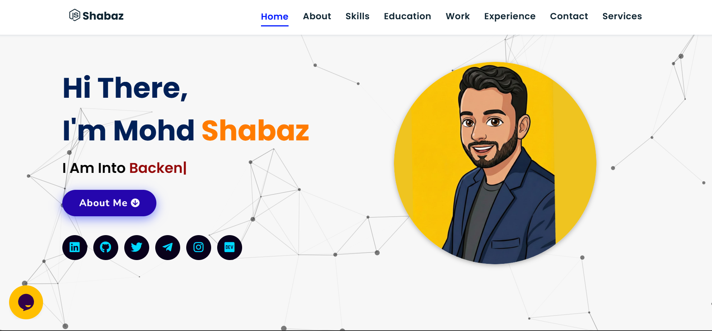

# Shabaz Khan | Portfolio Website

Welcome to my personal portfolio website.  
This website is built to showcase my skills, projects, experience, and online presence in a clean and professional way.

<a href="YOUR_LIVE_SITE_LINK_HERE" target="_blank"><b>Visit Live Website</b> 🚀</a>

## ✨ About Me
I am **Mohd Shabaz**, a passionate learner and aspiring developer focused on building modern digital experiences.  
I enjoy working on web technologies, automation, AI-related ideas, and practical projects that solve real problems.

I am always open to learning, building, and collaborating on exciting opportunities.

## 📌 Tech Stack
&nbsp;
&nbsp;
&nbsp;

### Extras
Particle.js, Typed.js, Tilt.js, Scroll Reveal, Font Awesome, JSON

## 🚀 Features
- Modern and responsive design
- Smooth user experience
- Clean and structured layout
- Interactive animations and effects
- Social media and contact integration
- Easy to customize and expand

## 📸 Sneak Peek

## 📊 GitHub Stats

  
  

## 🧠 What I Love Working On
- Web Development
- AI & Automation
- SaaS Ideas
- Problem Solving
- Creative Digital Projects

## 📬 Contact
Feel free to connect with me through any of the platforms below.

 <i class="fas fa-envelope"></i> Shabazkhan13356@gmail.com

 <i class="fas fa-map-marked-alt"></i> Kanpur, India-209861

  
  
  
  
  

## 🌟 Future Goals
- Build stronger real-world projects
- Improve technical and problem-solving skills
- Work on AI, SaaS, and automation-based products
- Grow professionally and collaborate globally
